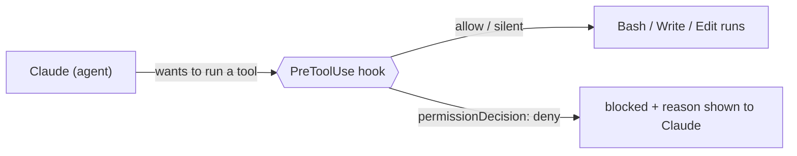

# Architecture

## The idea

Claude Code is an agent with powerful tools — `Bash`, `Write`, `Edit`, network
access. That's exactly the threat model of project **#7** (runtime security of AI
agents), pointed at the tool that edits your repo: a prompt-injected or simply
mistaken agent can `rm -rf`, exfiltrate over the network, or write a secret into
a file. This plugin adds **guardrails at the tool boundary**, the same way #9
guards the MCP boundary.

## Where the guardrails sit

Claude Code fires a **`PreToolUse`** hook *before* a tool runs. The hook receives
the event as JSON on stdin (`tool_name`, `tool_input`, …) and decides:

- print nothing, exit 0 → **defer** to the normal permission flow (allow), or
- print `{"hookSpecificOutput":{"hookEventName":"PreToolUse","permissionDecision":"deny","permissionDecisionReason":"…"}}` → **block**, and Claude sees the reason.

(Exit code 2 also blocks, with stderr as the message. We use the JSON form so the
reason reaches the model.)

## The three hooks

All are **stdlib-only Python** (run as plain `python3`, no venv) and share
[`_hooklib.py`](../hooks/_hooklib.py) (`read_event` / `deny` / `allow`).

1. **block_destructive** (`Bash`) — special-cases `rm` (dangerous only when both
   recursive/forced *and* aimed at `/`, `~`, `$HOME`, `*`, `.`, or a system dir),
   plus a rule table for fork bombs, `dd of=/dev/…`, `mkfs`, disk redirects,
   `chmod -R 777 /`, `curl … | sh`, and force-push to a protected branch.
2. **egress_allowlist** (`Bash`) — extracts http(s) hosts from the command and
   denies any not on [`config/egress-allowlist.txt`](../config/egress-allowlist.txt)
   (a host matches an entry or is a subdomain of it). Default-deny for the network.
3. **secret_scan** (`Write`/`Edit`/`MultiEdit`) — scans the content being written
   for credential shapes (AWS/GitHub/GitLab/Slack/Google/OpenAI keys, private
   keys, hard-coded `password=/secret=/token=` literals, excluding obvious
   placeholders) and blocks the write. Stops a secret landing in a file (and then
   in git history).

Wiring is in [`hooks/hooks.json`](../hooks/hooks.json) — the same `hooks` object
shape as `settings.json`, with script paths via `${CLAUDE_PLUGIN_ROOT}`.

## Policy-as-code: the restricted subagent

[`agents/security-reviewer.md`](../agents/security-reviewer.md) declares
`tools: Read, Grep, Glob` — a read-only allowlist. The subagent **cannot** edit
files, run shell, or reach the network, enforced by Claude Code, not by asking
nicely. That's least-privilege expressed as configuration: a reviewer that
physically can't change what it reviews. `/security-review` delegates to it.

## Why a plugin (not a `.claude/` you copy)

Standalone `.claude/` config lives in one project. A **plugin** is installed once
and applies everywhere, with versioned updates and a marketplace for
distribution. `.claude-plugin/plugin.json` is the manifest;
`.claude-plugin/marketplace.json` makes the repo itself installable via
`/plugin marketplace add`. Component dirs (`hooks/`, `agents/`, `commands/`) sit
at the plugin root and are auto-discovered.

## Limits (honest)

These are **heuristics, not a sandbox**. Shell is adversarial to parse: a
determined agent could obfuscate a command past `block_destructive`, use a host
the allowlist doesn't model, or encode a secret past `secret_scan`. The value is
defense-in-depth — catching the common, accidental, and obvious-injection cases —
not a guarantee. Keep real permissions and human review in the loop, and tune the
allowlist and patterns to each project.
